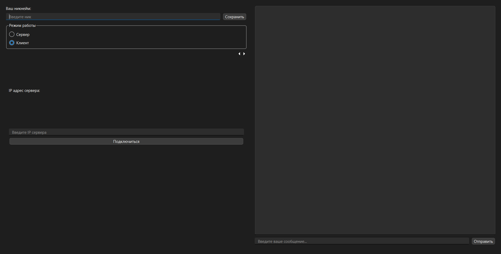

# IntranetChat

Простой кроссплатформенный мессенджер для общения в локальной сети, не требующий подключения к интернету. Проект создан для изучения сетевого программирования с использованием C++ и фреймворка Qt.

## О проекте

Идея проекта — создать легковесное приложение, которое позволяет пользователям в одной Wi-Fi сети обмениваться текстовыми сообщениями. Приложение работает по принципу "клиент-сервер": один пользователь создает чат (сервер), а остальные подключаются к нему по IP-адресу.

## 🚀 Основные возможности

*   **Работа в локальной сети:** Не требуется интернет или внешние серверы.
*   **Режимы Клиент/Сервер:** Один пользователь создает чат, другие подключаются.
*   **Простой интерфейс:** Интуитивно понятное окно с разделением на настройки и область чата.
*   **Сохранение никнейма:** Приложение запоминает ваш никнейм между сессиями.
   
  Мокап интерфейса

## 🛠️ Технологический стек

*   **Язык:** C++
*   **Фреймворк:** Qt 6 (Core, Gui, Widgets, Network)
*   **Среда разработки:** CLion / Qt Creator
*   **Система сборки:** CMake
*   **Сетевое взаимодействие:** TCP/IP сокеты (QTcpServer, QTcpSocket)

## 🏁 Начало работы

### Необходимые компоненты

*   Установленная среда Qt 6.
*   Компилятор C++, поддерживаемый Qt (MSVC, MinGW, Clang).
*   CMake (обычно идет вместе с IDE).

### Как использовать

1.  **Для сервера:** Запустите приложение, введите никнейм, выберите режим "Сервер" и нажмите "Создать диалог". Приложение покажет ваш локальный IP-адрес.
2.  **Для клиента:** Запустите приложение на другом устройстве, введите никнейм, выберите режим "Клиент", введите IP-адрес сервера и нажмите "Подключиться".
3.  Начинайте общение!
